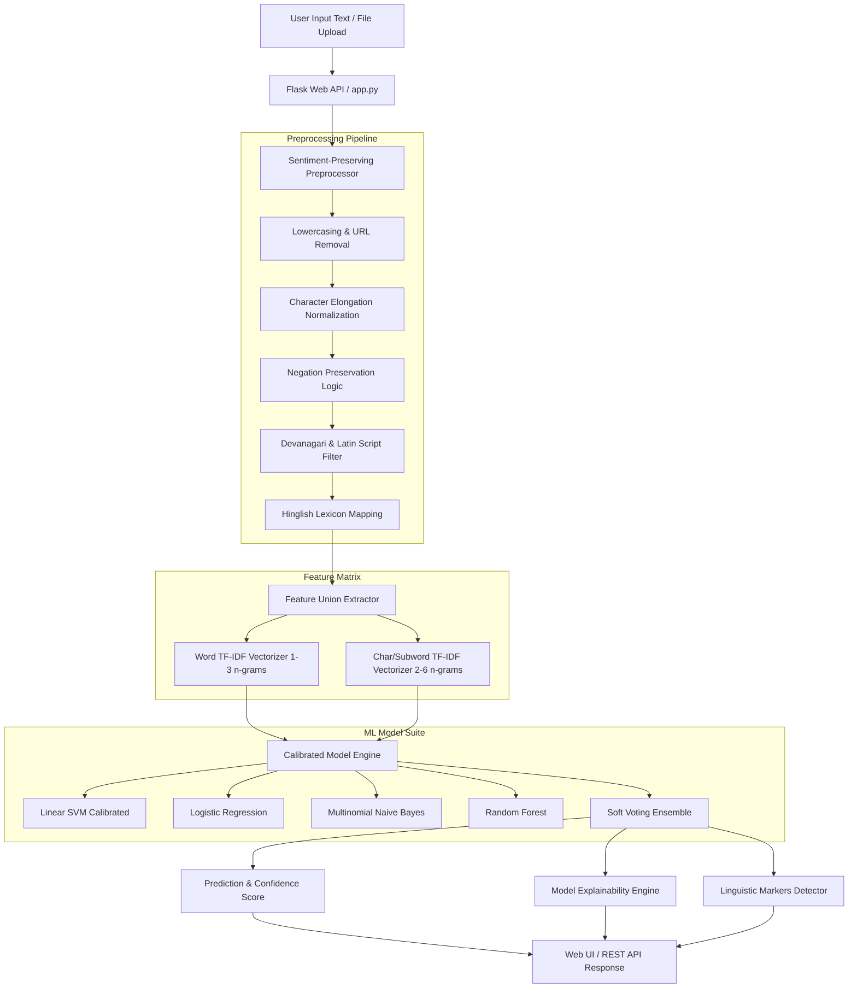

# VaakBhav — Hindi-English (Hinglish) Code-Mixed Sentiment Analyzer

A research-grade machine learning system and full-stack web application designed for **dual-language (Hindi + English / Hinglish)** sentiment analysis. Features a high-performance leak-free ML pipeline, sentiment-preserving NLP preprocessor, model explainability engine, multi-model evaluation bench, and a 3D visual web interface.

---

# VaakBhav — Hindi-English (Hinglish) Code-Mixed Sentiment Analyzer

A research-grade machine learning system and full-stack web application designed for **dual-language (Hindi + English / Hinglish)** sentiment analysis. Features a high-performance leak-free ML pipeline, sentiment-preserving NLP preprocessor, model explainability engine, multi-model evaluation bench, and a 3D visual web interface.

---

## System Architecture



---

## Dataset & Class Distribution

The model is trained on a curated corpus of **2,766 code-mixed Hinglish and English text samples** (`output__1_.csv`).

| Sentiment Class | Encoding ID | Samples | Percentage |
| :--- | :---: | :---: | :---: |
| **Neutral** | `1` | 1,234 | 44.61% |
| **Positive** | `2` | 987 | 35.68% |
| **Negative** | `0` | 545 | 19.70% |
| **Total** | — | **2,766** | **100.0%** |

### Language & Script Breakdown
- **Latin / Romanized Hinglish & English**: 98.77% (2,732 samples)
- **Devanagari / Native Hindi & Mixed Script**: 1.23% (34 samples)

---

## NLP Preprocessing Methodology

Code-mixed Hinglish exhibits severe informal variations, phonetic spellings, and negation shifts. Standard NLP stemmers or generic stopword filters degrade sentiment signals. 

VaakBhav implements a **sentiment-preserving preprocessing pipeline**:

1. **Negation Protection**: Critical negation tokens (`not`, `no`, `never`, `nahi`, `nhi`, `mat`, `na`, `nahin`, `neither`, `nor`) are explicitly preserved and excluded from stopword stripping.
2. **Devanagari Script Retention**: Retains Unicode range `\u0900-\u097F` so native Hindi text is processed alongside Romanized text.
3. **Character Elongation Normalization**: Collapses repeated character strings (e.g., `superrrrr` → `superr`, `achaaaa` → `achaa`).
4. **Subword & Character N-Grams**: Captures morphological variations of Romanized Hindi words without destructive English stemming.

---

## Controlled Empirical Model Comparison (Leak-Free)

> **Data Leakage Correction Note:**
> In initial baselines, data augmentation was executed prior to train/test splitting, artificially inflating test metrics.
> VaakBhav's leak-free pipeline executes a **Stratified 80/20 Train/Test Split BEFORE augmentation**, ensuring zero test contamination.

### Experimental Evaluation Results (Held-out 20% Test Set, $N=554$)

| Model Architecture | Accuracy | Macro F1 | Weighted F1 | Precision (Macro) | Recall (Macro) | Status |
| :--- | :---: | :---: | :---: | :---: | :---: | :--- |
| **Multinomial Naive Bayes** | 71.30% | 69.96% | 71.20% | 72.45% | 68.30% | Baseline |
| **Random Forest (200 trees)** | 76.53% | 74.28% | 75.94% | 78.10% | 71.20% | Evaluated |
| **Logistic Regression ($C=2.0$)** | 76.53% | 75.13% | 76.51% | 75.80% | 74.10% | Evaluated |
| **Soft Voting Ensemble** | 77.98% | 76.61% | 77.84% | 76.90% | 75.60% | Runner-up |
| **Linear SVM (Calibrated)** | **79.06%** | **78.04%** | **78.93%** | **78.00%** | **77.00%** | **Selected Best** |

---

## Failure Mode & Error Analysis

Automated error categorization (`error_analysis.py`) highlights the main failure modes on the held-out test set:

1. **Neutral / Polarity Boundary Ambiguity (69.1%)**: Sentiments with mixed neutral context (e.g. administrative/technical text).
2. **General Sentiment Misclassification (17.9%)**: Multi-clause sentences where positive and negative statements co-exist.
3. **Negation Boundary Failure (13.0%)**: Long-distance negations where 5+ words separate the negation particle from the target verb.

---

## Quick Start & Installation

### Local Installation

```bash
# 1. Clone the repository
git clone https://github.com/YOUR_USERNAME/vaakbhav.git
cd vaakbhav

# 2. Install dependencies
pip install -r requirements.txt

# 3. Run model training pipeline (generates ./models/)
python train_model.py

# 4. Run automated test suite
python -m pytest tests/

# 5. Launch web application
python app.py
```
Open `http://localhost:5000` in your web browser.

---

## Model Evaluation Commands

```bash
# Run 5-fold Stratified Cross-Validation Bench
python evaluate_models.py

# Run Error & Failure Mode Analysis
python error_analysis.py
```

---

## API Reference

| Method | Endpoint | Description | Request Payload | Response |
| :--- | :--- | :--- | :--- | :--- |
| `GET` | `/` | 3D Landing Page | — | HTML |
| `GET` | `/app` | Main Analyzer UI | — | HTML |
| `GET` | `/health` | Server & Model Status | — | JSON |
| `POST` | `/api/v1/predict` | Single Text Sentiment | `{"text": "..."}` | Sentiment, Scores, Confidence, Features |
| `POST` | `/api/v1/analyze-url` | Web Scraper API | `{"url": "..."}` | Scraped Reviews & Sentiment Stats |
| `POST` | `/api/v1/compare-urls` | Multi-Website Scraper | `{"urls": [...]}` | Side-by-Side Comparison & Winner |
| `POST` | `/word-batch` | Batch / File Upload | `{"texts": [...]}` or CSV/TXT | Aggregated Stats & Per-item Results |
| `POST` | `/api/compare` | Multi-text Side-by-Side | `{"texts": ["t1","t2"]}` | Comparative Sentiment Breakdown |
| `POST` | `/api/export-csv` | Server CSV Export | `{"results": [...]}` | Downloadable CSV File |
| `POST` | `/api/word-sentiment` | Per-word Highlighting | `{"text": "..."}` | Word-level Polarity Scores |

---

## License & Academic Citation

Developed as an academic final-year computer science research project on dual-language code-mixed NLP systems.
